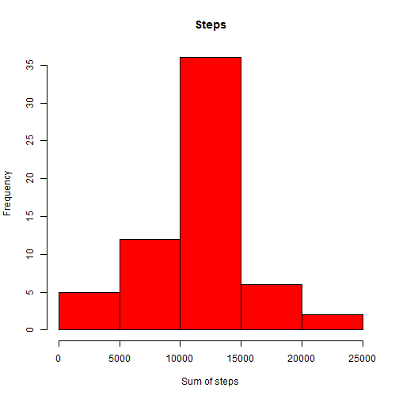

Question 1. Load the data.


```r
## 1.1
setwd("C:\\Users\\randallg\\Desktop\\Data Science Specialization\\5 Reproducible Research\\Home")
filePath <- "activity.csv"
data <- read.csv(file = filePath, header = TRUE, na.strings = c("NA"), colClasses = c("numeric","character","numeric"))
```

Question 2. Create histogram of steps. Also display summary.


```r
## 2.1
stepsByDay <- tapply(data$steps,data$date,sum,na.rm=TRUE)
## 2.2
hist(stepsByDay, main = "Steps", xlab = "Sum of steps", ylab = "Frequency", col = "red", breaks = 5)
```

 

```r
## 2.3
summary(stepsByDay)
```

```
##    Min. 1st Qu.  Median    Mean 3rd Qu.    Max. 
##       0    6778   10400    9354   12810   21190
```

Question 3. Plot avg number of steps per interval.


```r
## 3.1
avgStepsByInterval <- tapply(data$steps, data$interval, mean, na.rm=TRUE)
avgStepsByInterval <- data.frame(interval = names(avgStepsByInterval), averageNumSteps = avgStepsByInterval)
plot(avgStepsByInterval$interval,avgStepsByInterval$averageNumSteps,type = "l", main = "Average # steps per 5 min interval", xlab = "Interval", ylab = "Avg num steps")
```

 

```r
## 3.2
maxInterval <- avgStepsByInterval[avgStepsByInterval$averageNumSteps==max(avgStepsByInterval$averageNumSteps),]
maxInterval
```

```
##     interval averageNumSteps
## 835      835        206.1698
```

Question 4. Handle missing values by assigning the mean value for that particular interval. And then recalculate histogram.


```r
## 4.1
missingVal <- data[is.na(data$steps) == TRUE,]
nrow(missingVal)
```

```
## [1] 2304
```

```r
## 4.2
missingVal <- merge(missingVal, avgStepsByInterval, by.x = "interval", by.y = "interval", all = TRUE)
missingVal$steps <- missingVal$averageNumSteps
missingVal <- missingVal[,c("date","interval","steps")]
## 4.3
dataFixed <- merge(data, missingVal, by.x = c("date", "interval"), by.y = c("date", "interval"), all = TRUE)
dataFixed1 <- dataFixed[is.na(dataFixed$steps.x) == FALSE, c("date", "interval", "steps.x")]
dataFixed2 <- dataFixed[is.na(dataFixed$steps.x) == TRUE, c("date", "interval", "steps.y")]
names(dataFixed1) <- c("date", "interval", "steps")
names(dataFixed2) <- c("date", "interval", "steps")
dataFixed <- rbind(dataFixed1, dataFixed2)
## 4.4
stepsByDay <- tapply(dataFixed$steps,dataFixed$date,sum,na.rm=TRUE)
hist(stepsByDay, main = "Steps", xlab = "Sum of steps", ylab = "Frequency", col = "red", breaks = 5)
```

 

```r
summary(stepsByDay)
```

```
##    Min. 1st Qu.  Median    Mean 3rd Qu.    Max. 
##      41    9819   10770   10770   12810   21190
```

Question 5. Add new day type column.


```r
## 5.1
dataFixed$dayType <- unlist(lapply(weekdays(as.Date(dataFixed$date, format = "%Y-%m-%d")), function (x) { if (x %in% c("Saturday","Sunday")) "weekend" else "weekday" } ))
## 5.2
## Did not understand this one.
```
